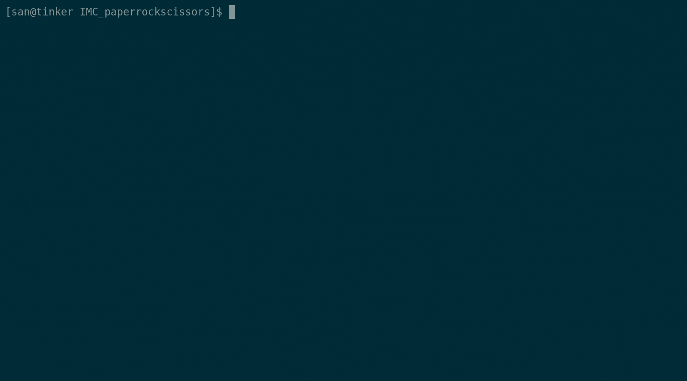

# Paper, Rock & Scissors 

Home assignment for IMC.  
MVP product based on my own assumptions about desired implementation.

## Requirements
Paper-Rock-Scissors is a game for two players. Each player simultaneously opens his/her hand to display
a symbol:  
* Fist equals rock  
* Open hand equals paper  
* Showing the index and middle finger equals scissors.  

The winner is determined by the following schema:
* Paper beats (wraps) rock
* Rock beats (blunts) scissors
* Scissors beats (cuts) paper.  

Write a program that plays Paper-Rock-Scissors between the computer and a real player. You should be
able to play the game n times before the program exits.

## Implementation

Application interacts with user via command-line interface, all instructions are provided on the fly.

Sources are tuned and ready to be packed into JAR with `./gradlew build`.  
Further this JAR can be executed as a standalone program.

Logs exist separate from player's text interface and can be found in `paper_rock_scissors.log` file.  

Test coverage is `92%`

## Improvement ideas
* Make computer's strategy more advance than random picking
* Make application web capable
* Implement Player-vs-Player mode

## Life demo  
